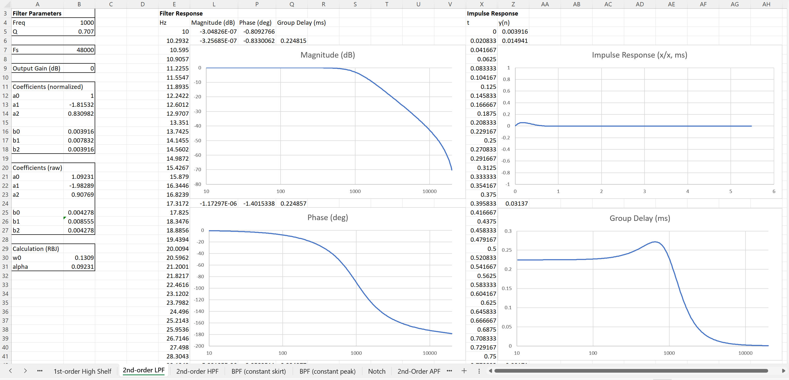

# Biquad Cookbook
## Biquad filter cookbook implemented in Excel

[Biquad Cookbook.xlsx](Biquad%20Cookbook.xlsx)

A ground-up reimplementation of the MiniDSP all-digital-coeffs spreadsheet with more consistent and more useful labeling and graphs between the various filters, additional filter types, and notes indicating the sources of the original filter derivations and calculations.

Filter types included:
- 1st order Lowpass
- 1st order Highpass
- 1st order Allpass
- 1st order Low Shelf
- 1st order High Shelf
- 2nd order Lowpass
- 2nd order Highpass
- 2nd order Allpass
- 2nd order Low Shelf
- 2nd order High Shelf
- Peaking EQ
- Bandpass (constant skirt)
- Bandpass (constant peak)
- Notch
- Linkwitz Transform

 

## Calculation, format

Each filter is calculated from a number of input parameters, corner or center frequency, Q, gain, etc, along with the sampling rate, Fs, and an Output Gain value in dB. The output gain value simply scales the b coefficients to increase headroom for filters with gain or make up amplitude from attenuating filters, and can be safely ignored by setting the value to 0.

The filter coefficients are calculated as they would be used in the typical biquad Direct Form I:

    y[n] = (b0/a0)*x[n] + (b1/a0)*x[n-1] + (b2/a0)*x[n-2] - (a1/a0)*y[n-1] - (a2/a0)*y[n-2]

 The coefficients are presented in the raw form and also in a normalized form scaled such that a0 is equal to 1, reducing the memory and calculation to five coefficients

 The labeling and arrangement of the coefficients matches the RBJ cookbook, which seems to be the de facto standard. The b coefficients are used for the feedforward path and the a coefficients are used for the feedback path. The feedback path is subtracted from the output, so the a coefficients are "normal", as opposed to the MiniDSP spreadsheet where the a coefficients have their sign reversed. Other platforms may require different ordering, but you can use these coefficients as they are in:
 - SigmaStudio
 - Teensy Audio Library
 - SciPy/NumPy
 - MATLAB/Octave (after accounting for MATLAB 1-indexing)

 

## References

The filter calculations come from a few sources:
- The famous [Robert Bristow-Johnson cookbook](https://www.musicdsp.org/en/latest/_downloads/3e1dc886e7849251d6747b194d482272/Audio-EQ-Cookbook.txt). There are a couple errors in the original version, so the [updated version from 2001](https://web.archive.org/web/20240227013132/http://music.columbia.edu/pipermail/music-dsp/2001-March/041752.html) is used for shelf filter calculation.
- [Designing Audio Effect Plugins in C++](https://www.willpirkle.com/about/books/), Will Pirkle.
- [Seven Woods Audio, AN-11](http://freeverb3vst.osdn.jp/doc/AN11.pdf)
- The MiniDSP [all-digital-coeffs-v1.2](https://www.minidsp.com/images/fbfiles/files/All_digital_coefs_v1-20101026.zip) spreadsheet

The frequency and phase response graphs are derived from this [digital filter cheat sheet](http://rs-met.com/documents/dsp/BasicDigitalFilters.pdf).
